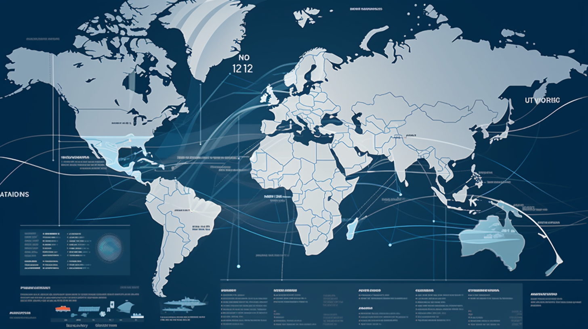

# ✈️ AirwayAtlas 🌎

Your go-to resource for airport city data in North America & the Caribbean! Featuring an interactive map 🗺️, powerful search 🔍, and an easy-to-integrate RESTful API 🚀.



## Table of Contents

- [Features](#features)
- [Getting Started](#getting-started)
- [API Documentation](#api-documentation)
- [Contributing](#contributing)
- [Release History](#release-history)
- [License](#license)

## Features

- Comprehensive database of airport cities in the USA, Canada, Mexico, and the Caribbean
- Interactive map for easy visualization of airport locations and control centers
- Powerful search functionality, allowing users to search by zip code, airport code, city, state, or region
- RESTful API for seamless integration with third-party applications

## Getting Started

1. Clone the repository:

```bash
git clone https://github.com/cywf/AirwayAtlas.git
```

2. Follow the instructions in the `backend` and `frontend` directories to set up the infrastructure, API, and frontend respectively.

3. Visit the frontend URL to start exploring airport cities!

## API Documentation

For detailed API documentation, visit our [API Documentation](#) page.

## Contributing

We welcome contributions! Please read our [Contributing Guide](CONTRIBUTING.md) to learn how you can get involved.

## Release History

- `v1.0.0` - AirwayAtlas v1.0.0 - Initial Release

## License

This project is licensed under the AGPL License - see the [LICENSE](LICENSE) file for details.
